<p align="center">
  
</p>

<p align="center">
  <a href="https://github.com/n00bgames/eve-quartermaster"></a>
  
  
</p>

<p align="center">
  
  
  
  
  
  
</p>

# EVE Quartermaster

**EVE is Excel in a flight suit.**

EVE Quartermaster is a containerized, database-first EVE Online quartermaster and alliance operations tool. It tracks characters, corporations, assets, blueprints, recipes, skills, standings/contact sync, wallet snapshots, permissions, audit events, and long-term analytics from EVE ESI plus imported SDE data.

This is an early beta candidate for private/public testing. It is already useful, but the data model and API surface are still moving quickly.

## Current Capabilities

- Account login, first-admin bootstrap, role management, one-time invite links, and per-section permissions.
- EVE SSO linking for characters, with linked-character ownership, unlinking, scope checks, and privacy controls.
- Character asset sync, corporation asset sync, corporation blueprint sync, corporation wallet division sync, and skill sync.
- Asset ledger with sortable columns, fast dropdown filters, partial search, click-to-filter cells, CSV export, and Janice-friendly copy output.
- Blueprint and recipe views powered by SDE import, with BPO/BPC filters, ME/TE badges, owner filters, sortable blueprint lists, and recipe detail modals.
- Corporation page with enrolled corporations, CEO/member metadata where available, sync status, wallet divisions, and eligible sync characters.
- Roster page for corporation-grouped character display.
- Contact/standing propagation tools using writable ESI character contacts.
- Notifications, private messages, and admin audit log for sync transparency.
- Historical analytics foundation with snapshot runs, metric metadata/versioning, baseline-aware deltas, exports, and composable widgets.
- Navigation suite with SDE-backed route planning, gatecheck summaries, operational starmap rendering, and security-status color coding.
- Hauling intelligence widgets for industrial kill heat, PvP system intel, smartbomb indicators, and Local Threat analysis with background queue progress for large systems.
- Jump Freighter plotter with JDC/JFC fuel math, station/cyno guidance, nearby operational map context, and 24-hour industrial kill visibility per jump.
- Sideloadable Android WebView wrapper build script that outputs `EQM.apk`.

## Screenshots

A quick tour of the current beta surface, ordered roughly the way a new Quartermaster operator would encounter the tool.

### Command Center

| Overview | Analytics Platform |
| --- | --- |
| 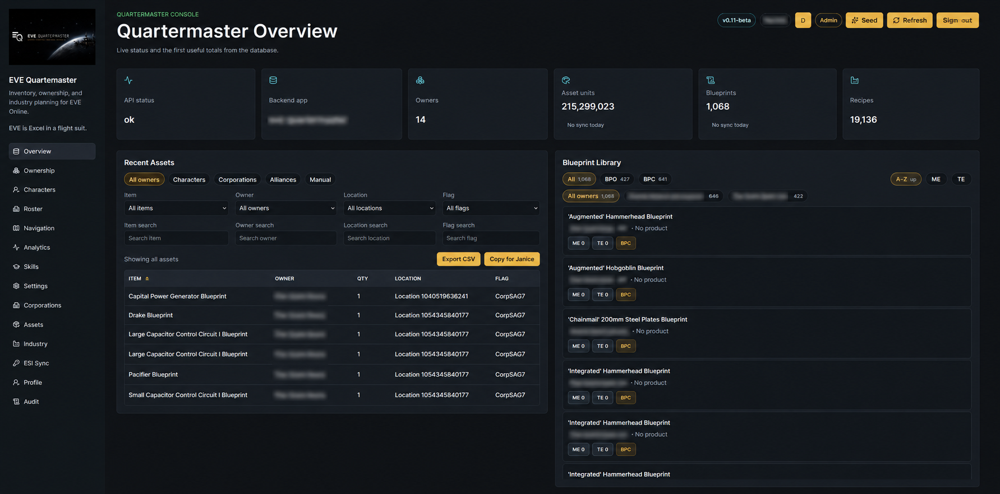 | 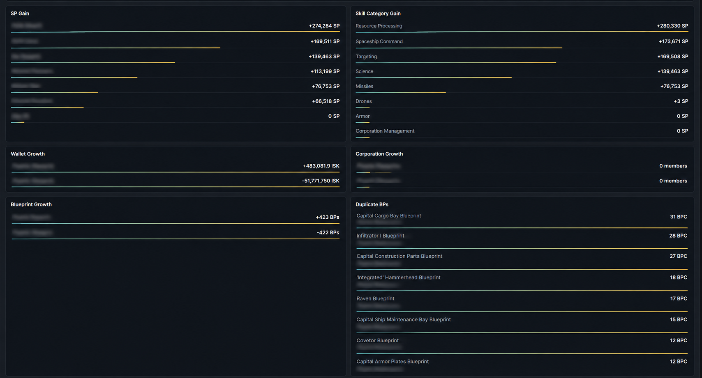 |

### Assets, Industry, And Corporations

| Asset Ledger | Blueprint And Recipe Library |
| --- | --- |
| 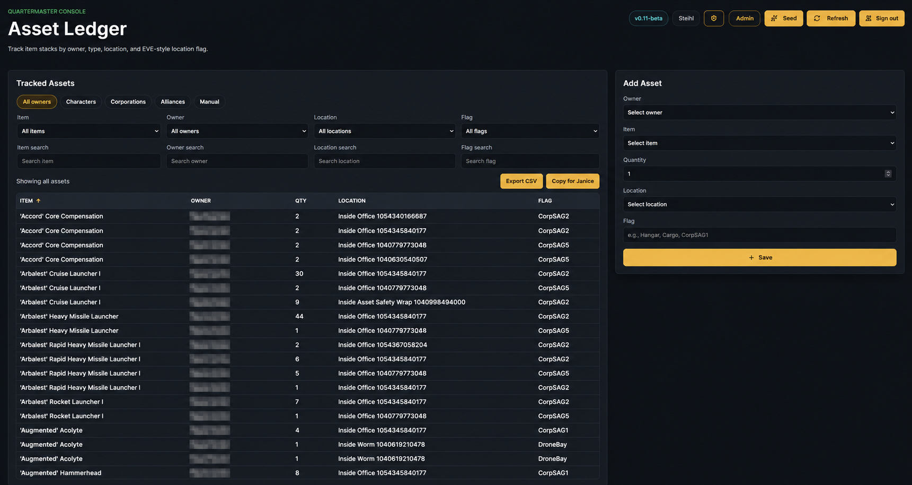 | 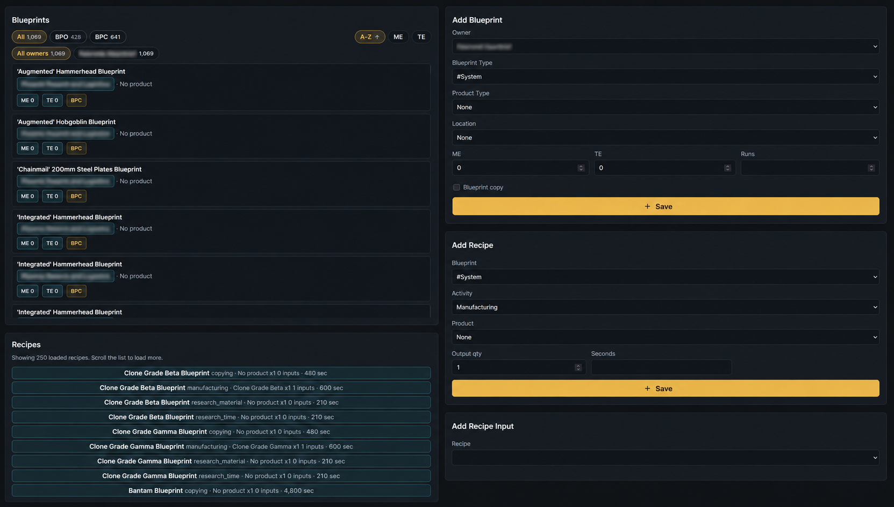 |

| Corporation Sync | ESI Sync And Character Contacts |
| --- | --- |
| 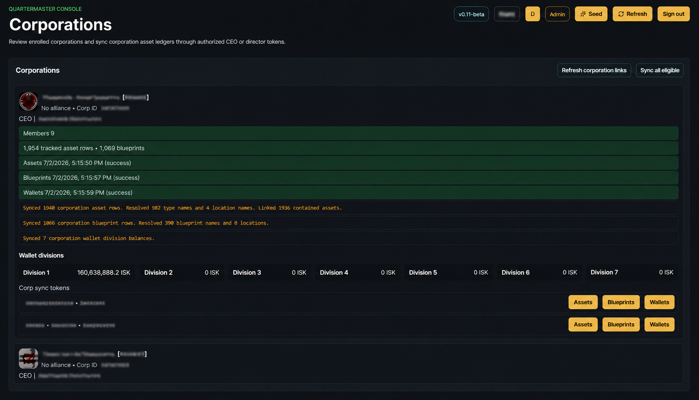 | 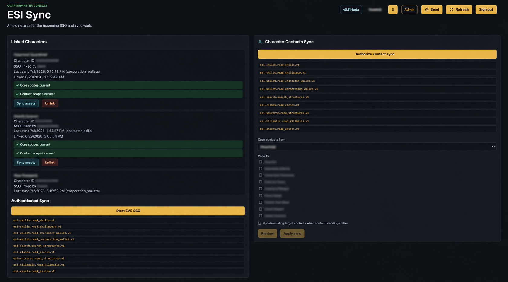 |

| Character Skills |
| --- |
| 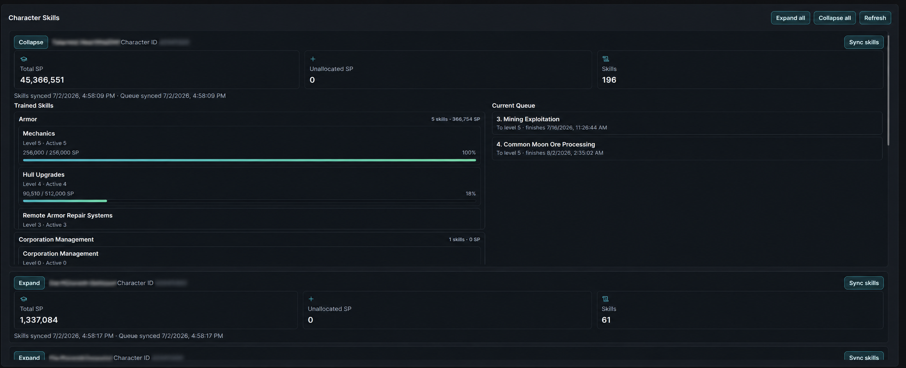 |

### Navigation And Hauling Intel

| Navigation Hub | Route Checker |
| --- | --- |
| 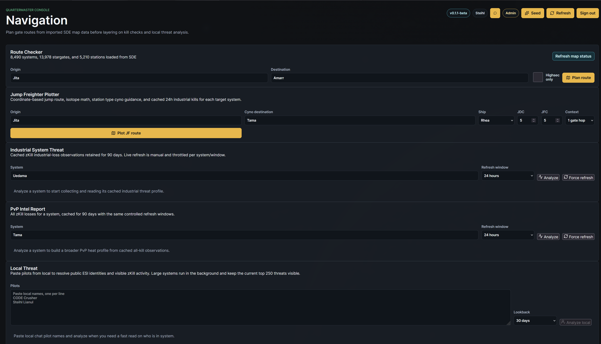 | 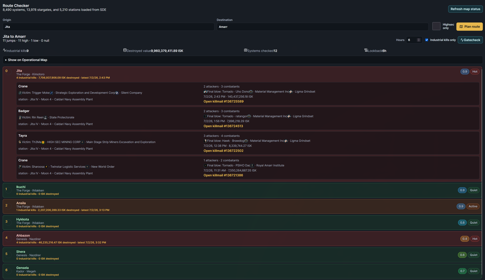 |

| Industrial System Threat | PvP Intel Report |
| --- | --- |
| 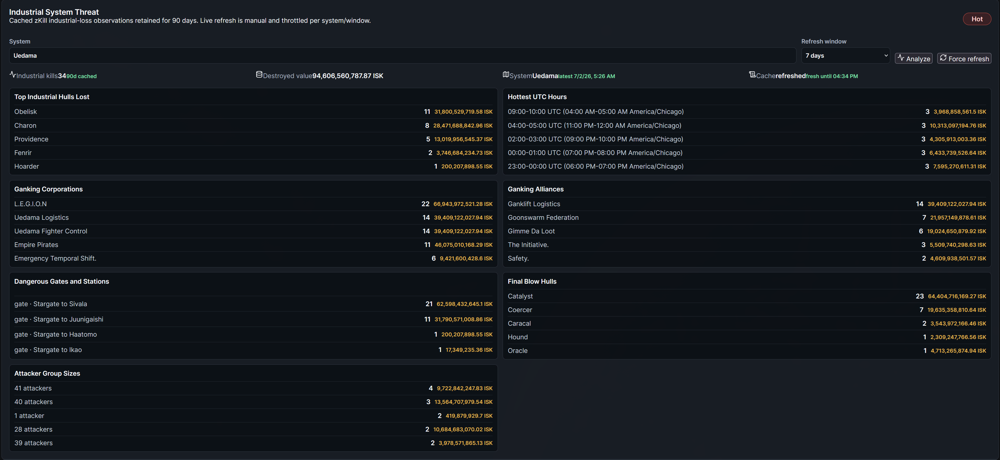 | 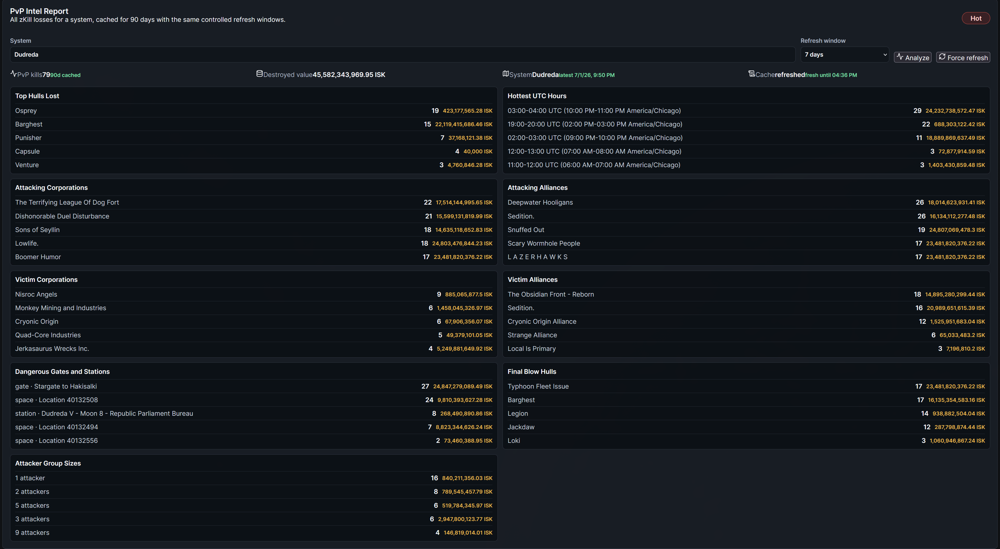 |

| Local Threat Analysis | Jump Freighter Plotter |
| --- | --- |
| 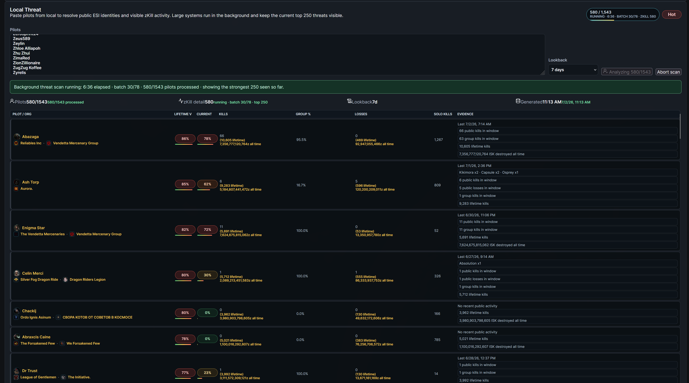 | 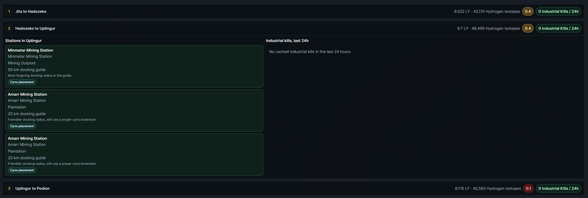 |

| Operational Jump Freighter Map |
| --- |
| 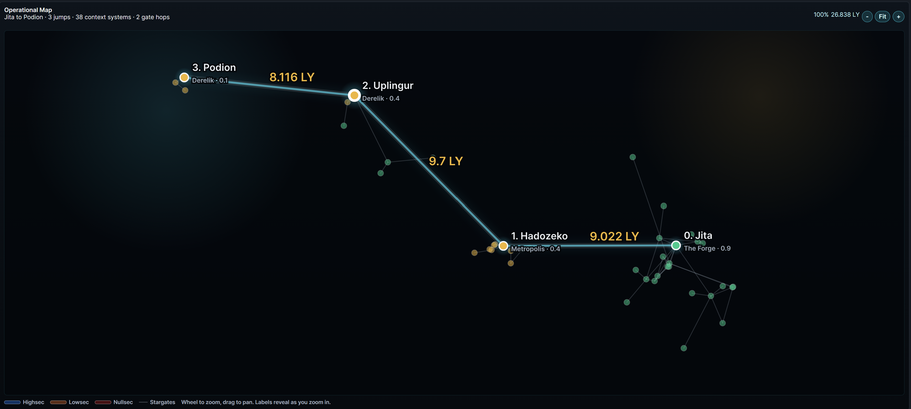 |

### Account, Settings, And Audit

| Profile And Messages | Audit Log |
| --- | --- |
| 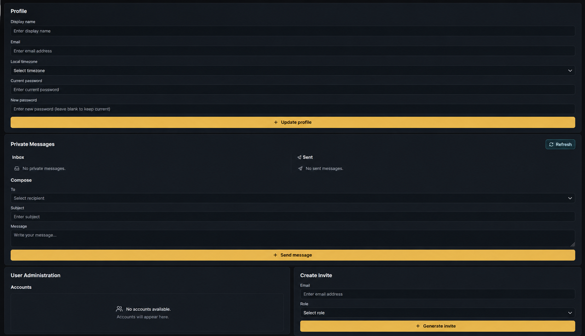 | 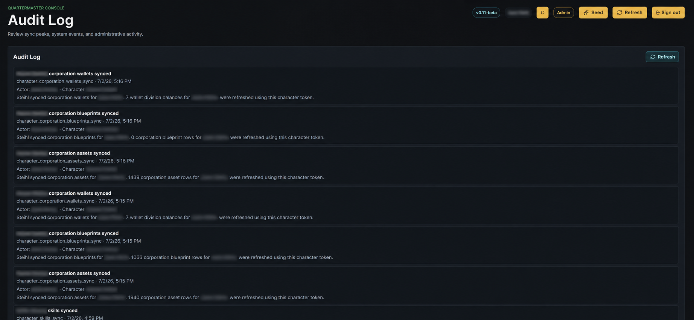 |

| Settings And SDE Import | Permissions And Privacy |
| --- | --- |
| 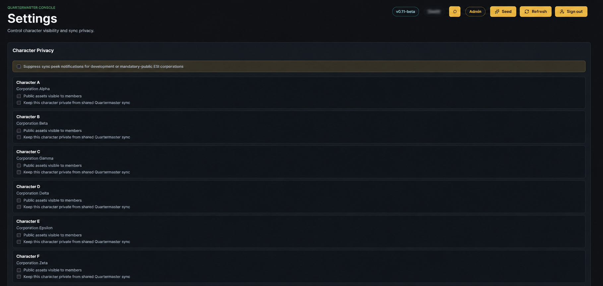 | 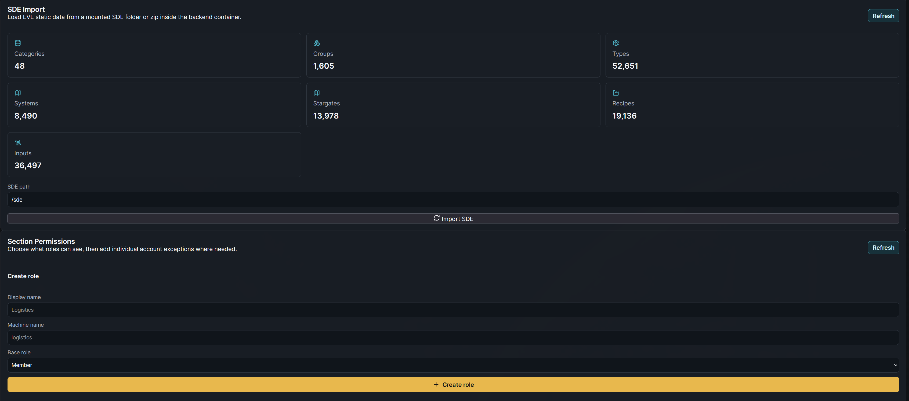 |

| Additional Settings |
| --- |
| 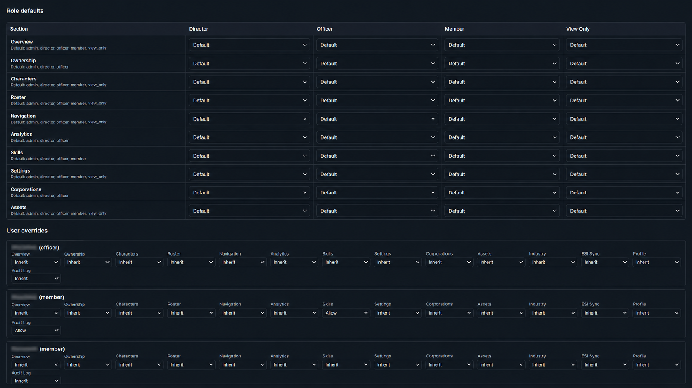 |

## Stack

- **Frontend:** React, TypeScript, Vite, lucide-react.
- **Backend:** FastAPI, SQLAlchemy, Alembic.
- **Database:** PostgreSQL.
- **Worker/cache:** Redis-backed worker placeholder for longer-running sync work.
- **Runtime:** Docker Compose.
- **External data:** EVE ESI/SSO and EVE Static Data Export.
- **Mobile:** Minimal Android WebView shell for sideload testing.

## Run Locally

### Prerequisites

- [Docker Desktop](https://www.docker.com/products/docker-desktop/) with Docker Compose support enabled.
- Git for cloning the repository.
- An EVE developer application if you want ESI/SSO sync locally.
- Optional: Android Studio or Android SDK command-line tools if you want to build `EQM.apk`.

### First Run

From PowerShell in the repository root:

```powershell
copy .env.example .env
docker compose up --build
```

Then open:

- Frontend: http://localhost:5173
- Backend health: http://localhost:8000/api/health
- OpenAPI docs: http://localhost:8000/docs
- Schema metadata: http://localhost:8000/api/metadata/schema

On first launch, create the administrator account from the bootstrap screen. After that, use the admin account to create invites, configure permissions, import SDE data, and link EVE characters through SSO.

If the frontend loads but data panels are empty or offline, check the containers:

```powershell
docker compose ps
docker compose logs backend
```

To reset all local container data during early testing, stop the stack and remove volumes:

```powershell
docker compose down -v
```

That deletes the local PostgreSQL and Redis volumes, so only use it when you intentionally want a fresh database.

## EVE SSO Configuration

Local EVE SSO settings live in `.env`, which is intentionally ignored by source control:

- `EVE_SSO_CLIENT_ID`
- `EVE_SSO_CLIENT_SECRET`
- `EVE_SSO_CALLBACK_URL`
- `TOKEN_ENCRYPTION_KEY`
- `FRONTEND_URL`

The configured callback must exactly match the callback in the EVE developer portal. For local-only development, the callback is usually:

```text
http://localhost:8000/api/esi/auth/callback
```

For a hosted test instance, set both the EVE developer callback and `EVE_SSO_CALLBACK_URL` to the hosted backend callback, and set `FRONTEND_URL` to the hosted frontend URL so SSO returns users to the application instead of raw API JSON.

When scopes are added or changed, linked characters need to run EVE SSO again before new permissions are available to sync workers.

## SDE Import

The app can import EVE Static Data Export files from a local read-only mount. Put an extracted SDE folder or SDE zip under `./sde`, or set `SDE_HOST_PATH` in `.env` to another host folder. Inside containers this is mounted as `/sde` by default.

Accepted layouts include modern SDE root files:

- `categories.yaml`
- `groups.yaml`
- `types.yaml`
- `blueprints.yaml`

Older FSD layouts are also accepted:

- `fsd/categoryIDs.yaml`
- `fsd/groupIDs.yaml`
- `fsd/typeIDs.yaml`
- `fsd/blueprints.yaml`

Admins can run the import from **Settings -> SDE Import**. Navigation, route maps, recipes, blueprint activity, station guidance, and skill grouping all get better as SDE coverage improves.

## Android APK

The repository includes a small Android wrapper in `android-eqm/`. It builds a sideloadable WebView APK named `EQM.apk`.

From PowerShell in the repository root:

```powershell
.\build-eqm-apk.bat
```

Override the default app URL for a test build:

```powershell
$env:EQM_URL = "http://192.168.0.20:5173/"
.\build-eqm-apk.bat
```

If Gradle dependencies need to be downloaded:

```powershell
$env:EQM_ONLINE = "1"
.\build-eqm-apk.bat
```

The current wrapper is intended for sideload testing, not Play Store distribution.

## Testing Checklist

After `docker compose up --build`, confirm:

1. The frontend loads and shows API status `ok`.
2. First admin bootstrap or normal login works.
3. EVE SSO can link a character and returns to the frontend.
4. Asset sync populates readable item/location/owner data.
5. Asset filters, CSV export, and Janice copy respect the current filter.
6. Corporation sync pulls eligible corporation assets, blueprints, member metadata, and wallet divisions where scopes allow.
7. Skill sync completes, skills group under real categories, and category SP totals display.
8. SDE import completes and recipes are browsable.
9. Analytics snapshots show totals immediately, but first-observation baselines do not inflate gain widgets.
10. Navigation route planning works from SDE data, and gatecheck details open for route systems.
11. Jump Freighter plotting calculates fuel, station cards, cyno guidance, and industrial kills per jump.
12. Local Threat accepts a large paste, shows queue progress, and renders top threats as the background job runs.
13. Notifications, private messages, audit log, and permissions behave according to the signed-in role.

## Roadmap

- Hardening pass for public testers, including clearer empty states and friendlier setup diagnostics.
- More complete industry planning: owned vs missing materials, procurement options, build readiness, and market pricing.
- Fittings browser for corporation and opt-in personal fittings.
- Expanded analytics platform: custom widget dashboards, report builder, CSV/JSON exports, and longer retention controls.
- More SDE coverage for market groups, dogma attributes, icons, station/system geography, and richer type metadata.
- More durable background job storage for long threat scans, ESI syncs, and scheduled snapshot capture.
- Signed/release APK path after sideload testing stabilizes.
- Deeper navigation overlays for assets, contracts, structures, cyno ranges, and route-specific operational planning.

## License

EVE Quartermaster is licensed under the **GNU Affero General Public License v3.0 or later**. See `LICENSE` for details.

This project is not affiliated with or endorsed by CCP Games. EVE Online and related names are trademarks of CCP hf. EVE ESI data belongs to its respective owners and is accessed through authorized user tokens.

## AI Collaboration Notice

This project is collaboratively created with generative AI. Human project direction, review, testing, deployment choices, EVE domain decisions, and final stewardship remain with the project maintainers.


