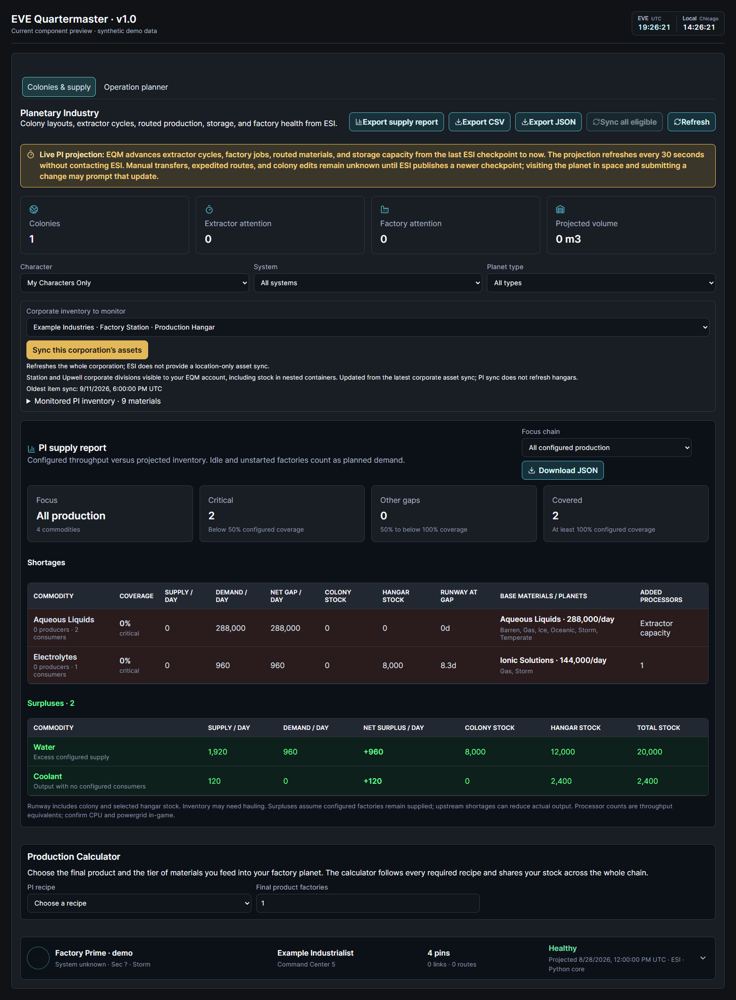
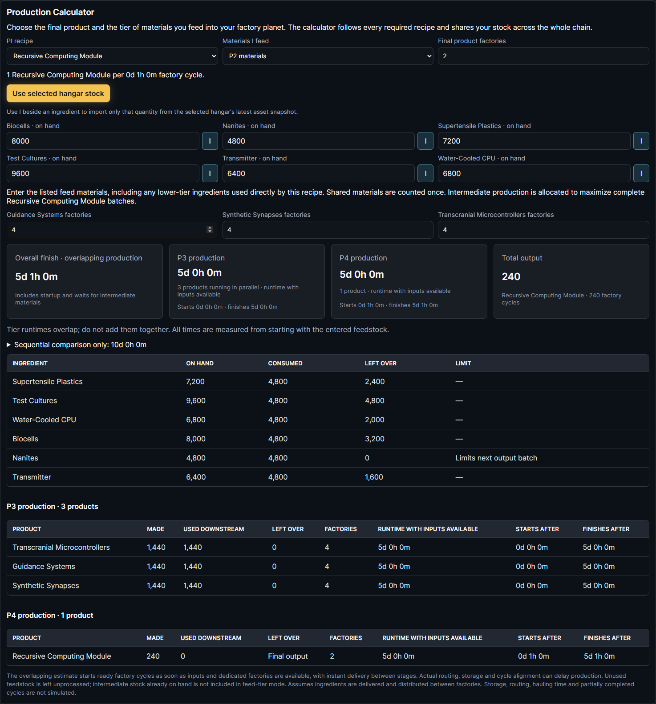
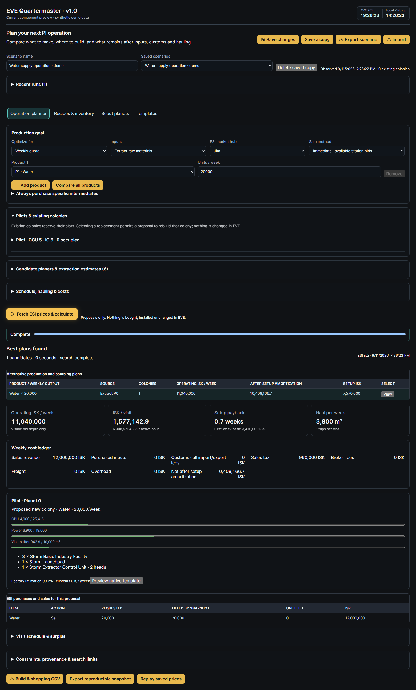
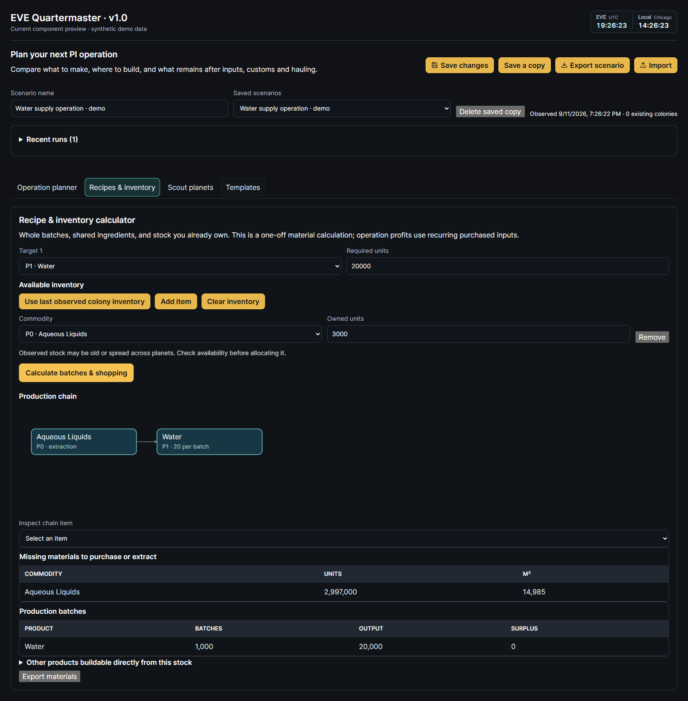
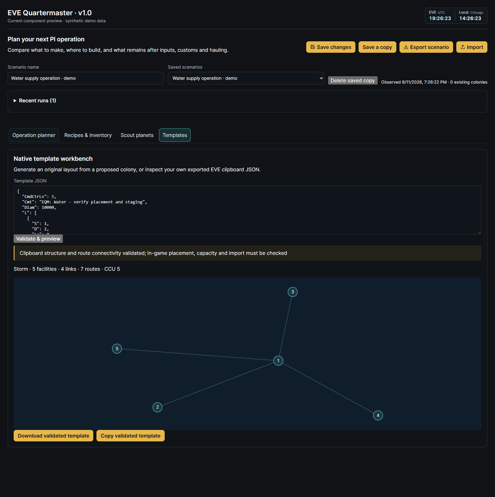
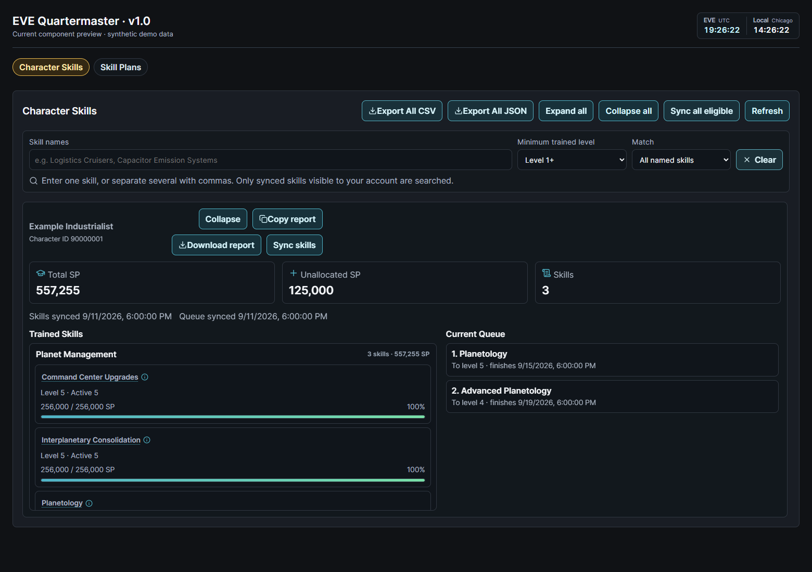
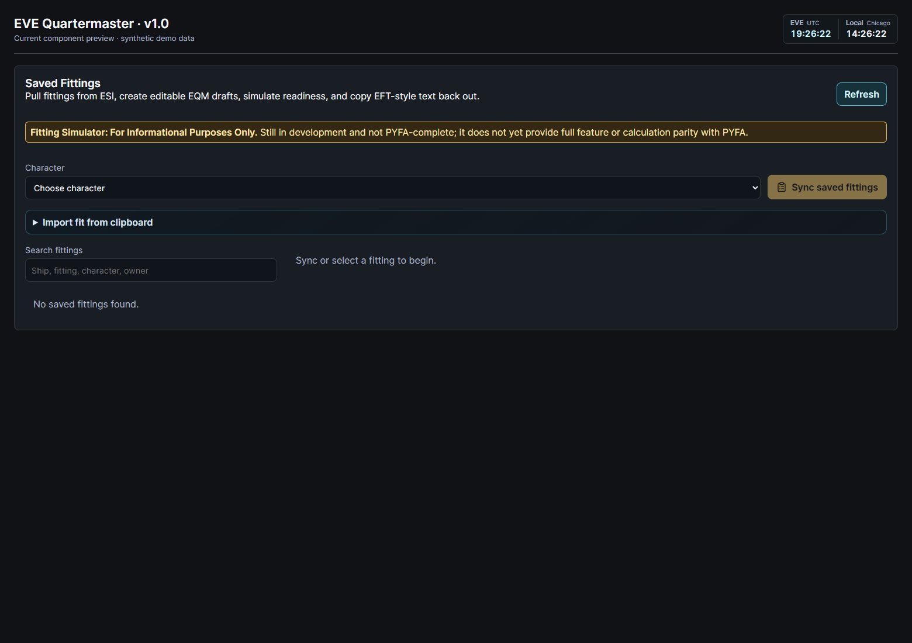

# EQM screenshot gallery

Reconciled on **September 11, 2026** against source commit `f894f27ad7fb2ef4956e5bef2e97d3865fe8cfd2`, the v1.0 candidate. [README](../README.md) · [Release notes](releases/v1.0.md) · [Install](../README.md#install)

## How to read this gallery

The v1.0 images are fresh browser captures of the actual current React components in a local preview, using synthetic pilots, stock and market data. They are component demonstrations, not authenticated production-server screenshots or live EVE state. The preview header is labeled; the clocks are the actual header-clock component. The calculator images are cropped to that component. Native Rust executed the supply/chain calculations; the planner used the disposable API preview and native allocation worker.

All **63 existing images** remain linked below. They are historical: some are demo illustrations or reconstructed/sanitized panels, and none is certified as an exact v1.0 screenshot. This audit reconciles module names and visible UX coverage; it does not certify runtime or PYFA parity. No old pixels were repainted to suggest a new version.

## v1.0 highlights

### Corporate stock, sync, scopes and surpluses

My Characters Only, a selected corporate hangar, the corporation sync action, separate stock columns and green surpluses. Demo factory configuration is illustrative.

[Open full resolution](../static/ss/v1.0/pi-supply.png)

### P2 to P4 production

The current calculator with individual I imports, bulk stock import, intermediate factory counts, overlapping completion, bottlenecks and leftovers. Demo inventory produces 240 Recursive Computing Modules.

[Open full resolution](../static/ss/v1.0/pi-production.png)

### Operation planner

A completed weekly-quota scenario with costs, pilot/planet allocation, facility capacity and build/shopping export. Market prices and pilots are synthetic; this is not a profit forecast.

[Open full resolution](../static/ss/v1.0/pi-planner.png)

### Recipes and inventory

Dependency graph, available stock, complete batches and missing-material calculations.

[Open full resolution](../static/ss/v1.0/pi-recipes.png)

### Native template workbench

Actual generated JSON and pin/link preview. In-game placement, routing, capacity and import remain subject to validation.

[Open full resolution](../static/ss/v1.0/pi-template.png)

### Skills and queues

Current Export All CSV/JSON controls and an expanded demo skill profile and training queue. Header uses the current EVE/local clock component.

[Open full resolution](../static/ss/v1.0/skills-exports.png)

### Fitting development notice

Current module entry screen, deliberately shown without a simulated fit. Informational only, still in development, not PYFA-complete.

[Open full resolution](../static/ss/v1.0/fittings-status.png)

[Production Calculator on mobile](../static/ss/v1.0/pi-production-mobile.png) · [Capture provenance](../static/ss/v1.0/capture-receipt.json)

## Suite gallery

The table covers every current sidebar module, plus navigation subtools and the external SSO setup reference. Current navigation is defined in [main.tsx](../frontend/src/main.tsx); the [README feature guide](../README.md#using-eqm-sections) describes behavior. **Battle Reports has no dedicated gallery image yet**; this gap is explicit rather than filled with an unrelated legacy screen.

| Current module / workflow | Earlier images | Reconciliation with current UX |
| --- | --- | --- |
| Overview | [overview.png](../static/ss/overview.png) · [eqm-overview.png](../static/ss/eqm-overview.png) | Current overview adds the EVE/local clocks and newer navigation entries. Earlier summary cards are historical. |
| Navigation | [navigation.png](../static/ss/navigation.png) · [eqm-navigation.png](../static/ss/eqm-navigation.png) · [routecheck.png](../static/ss/routecheck.png) · [eqm-route-hourly-intel.png](../static/ss/eqm-route-hourly-intel.png) · [pvpintel.png](../static/ss/pvpintel.png) · [eqm-pvp-hourly-intel.png](../static/ss/eqm-pvp-hourly-intel.png) · [indythreat.png](../static/ss/indythreat.png) · [localthreat.png](../static/ss/localthreat.png) · [jfplotter.png](../static/ss/jfplotter.png) · [jfpmap.png](../static/ss/jfpmap.png) | Route/gatecheck, hourly traffic, PvP/industrial/local intel and jump-ship maps remain under Navigation. Old jump-plotter screenshots do not show every current replot/docking control. |
| Characters | [eqm-characters.png](../static/ss/eqm-characters.png) | Character dossiers exist; this old demo-card layout does not establish current dossier or standings coverage. |
| Skills | [skills.png](../static/ss/skills.png) · [eqm-skills.png](../static/ss/eqm-skills.png) | Superseded by the v1.0 Skills capture; old images omit full CSV/JSON queue exports and current skill-plan controls. |
| Fittings - WIP | [eqm-fittings.png](../static/ss/eqm-fittings.png) | Historical demo only. Superseded for status/notice by the v1.0 fitting capture. Never use the old readiness/stats graphic as validation of simulator accuracy. |
| Jump Clones | [eqm-jump-clones.png](../static/ss/eqm-jump-clones.png) | Legacy sanitized detail crop; current module also manages clone and implant-set context. |
| Roster | [eqm-roster.png](../static/ss/eqm-roster.png) | Corporation-grouped roster remains available; old demo navigation and cards are not a current full-page capture. |
| ESI Sync | [esi.png](../static/ss/esi.png) · [eqm-esi-sync.png](../static/ss/eqm-esi-sync.png) · [eqm-contact-sync-exact-match.png](../static/ss/eqm-contact-sync-exact-match.png) · [eqm-v019-contact-sync-exact-match.png](../static/ss/eqm-v019-contact-sync-exact-match.png) | Sync and contact propagation remain available; scope requirements and authorization must follow current UI/docs, not an old checkbox list. |
| Market | [eqm-market.png](../static/ss/eqm-market.png) | Historical appraisal example; current prices and available order data must be fetched. |
| Corporate Exchange | [eqm-corporate-exchange.jpg](../static/ss/eqm-corporate-exchange.jpg) · [eqm-corporate-exchange-editor.jpg](../static/ss/eqm-corporate-exchange-editor.jpg) · [eqm-corporate-exchange-detail.jpg](../static/ss/eqm-corporate-exchange-detail.jpg) | Listings, editor and detail examples remain feature references. Inventory and market values are dated. |
| HyperNet Tracker | [eqm-hypernet-tracker.jpg](../static/ss/eqm-hypernet-tracker.jpg) · [eqm-hypernet-offer-detail.jpg](../static/ss/eqm-hypernet-offer-detail.jpg) | Manual-first tracking and offer details remain available. These are not live ESI HyperNet records. |
| Bounty Analytics | [eqm-bounty-analytics.png](../static/ss/eqm-bounty-analytics.png) · [eqm-v019-bounty-analytics.png](../static/ss/eqm-v019-bounty-analytics.png) | Private bounty analytics remains available; this overview is not an authorization or data-freshness test. |
| Notes & Lists | [eqm-notes-lists.png](../static/ss/eqm-notes-lists.png) | Legacy reconstructed demo; current Notes & Lists is the feature location. |
| Manufacturing | [eqm-manufacturing.png](../static/ss/eqm-manufacturing.png) | Legacy reconstructed production-ledger example; follow current input and valuation controls. |
| Research Projects | [eqm-research-projects.png](../static/ss/eqm-research-projects.png) | Legacy reconstructed job/history example; actual job state comes from retained ESI records. |
| Mining Ledger & settlements | [eqm-mining-ledger.png](../static/ss/eqm-mining-ledger.png) · [eqm-mining-analytics.png](../static/ss/eqm-mining-analytics.png) · [eqm-mining-settlement.png](../static/ss/eqm-mining-settlement.png) | Mining history, residue analytics and settlements remain in the mining workflow. Settlement crop shows only the opening steps. |
| Planetary Industry | [eqm-planetary-industry.png](../static/ss/eqm-planetary-industry.png) | Superseded by v1.0 PI captures. Missing in this old picture: planner, corporate supply selection/sync, green surpluses, scoped pilots, individual imports and chain timing. |
| Corporations | [corps.png](../static/ss/corps.png) · [eqm-corporations.png](../static/ss/eqm-corporations.png) | Corporation metadata, divisions and eligible sync characters remain available. Old images cannot demonstrate the new PI corporation-role boundary. |
| Ownership | [eqm-ownership.png](../static/ss/eqm-ownership.png) | Ownership and locations remain available; old demo cards are historical. |
| Assets | [assets.png](../static/ss/assets.png) · [eqm-assets.png](../static/ss/eqm-assets.png) | Asset ledger remains available; historical quantities/locations and layout are not current inventory evidence. |
| Industry | [industry.png](../static/ss/industry.png) · [eqm-industry.png](../static/ss/eqm-industry.png) | Blueprints and SDE recipe views remain available. Historical blueprint/category cards are references. |
| Contracts | [eqm-contracts.png](../static/ss/eqm-contracts.png) | Contracts remain available; old example values/statuses are not live contracts. |
| Analytics | [analytics.png](../static/ss/analytics.png) · [eqm-analytics.png](../static/ss/eqm-analytics.png) | Historical analytics exists with expanded domains, retention and coverage controls; these early charts are not the full current analytics UX. |
| Doctrines | [eqm-doctrine-management.png](../static/ss/eqm-doctrine-management.png) | Legacy reconstructed example; current doctrines support readiness plans and historical fit snapshots. |
| SRP Requests | [eqm-srp-operations.png](../static/ss/eqm-srp-operations.png) · [eqm-srp-analytics.png](../static/ss/eqm-srp-analytics.png) | Legacy reconstructed operations/analytics examples; current review history, valuation and permissions require current UI. |
| Killboard | [eqm-killboard.png](../static/ss/eqm-killboard.png) · [eqm-v019-killboard.png](../static/ss/eqm-v019-killboard.png) | Killboard remains available. Battle Reports is now a separate Fleet Operations module, not pictured here. |
| Battle Reports | [Feature guide](../README.md#using-eqm-sections) | Available in the current app, but no dedicated screenshot exists in this gallery. Do not mistake the old Killboard image for Battle Reports. See the README feature guide. |
| Calendar & Events | [eqm-calendar-events.png](../static/ss/eqm-calendar-events.png) | Events remain available; dated month/RSVP example does not show every current fleet/attendance workflow. |
| Recruiting | [eqm-recruiting.png](../static/ss/eqm-recruiting.png) | Legacy reconstructed configuration example; current public recruiting and staff review workflows extend beyond this screen. |
| Profile | [profile.png](../static/ss/profile.png) · [eqm-profile.png](../static/ss/eqm-profile.png) | Profile, private messages and authorized user administration remain available. User management is not a separate current sidebar module. |
| Settings | [settings1.png](../static/ss/settings1.png) · [settings2.png](../static/ss/settings2.png) · [settings3.png](../static/ss/settings3.png) · [eqm-settings.png](../static/ss/eqm-settings.png) | Current settings include SDE/configuration/privacy/permissions; old settings and scope choices are historical. |
| Audit | [audit.png](../static/ss/audit.png) · [eqm-audit.png](../static/ss/eqm-audit.png) | Audit remains available. Old demo events/layout are historical. |
| CCP developer setup | [developer.png](../static/ss/developer.png) | External CCP configuration screenshot, not an EQM module. Use the current README SSO guide; scopes/callbacks vary by deployment. |

## Historical image index

Every pre-v1.0 image is listed once here. **Historical reference** means capture provenance/current layout was not revalidated. **Legacy demo** identifies visibly synthetic/demo material. **Reconstructed/sanitized** identifies panels covered by the existing screenshot preparation scripts, not a fresh capture. Shared file hashes are labeled; duplicate files remain for link compatibility.

| File | Current home | Status / replacement |
| --- | --- | --- |
| [analytics.png](../static/ss/analytics.png) | Analytics | Historical reference; older UX |
| [assets.png](../static/ss/assets.png) | Assets | Historical reference; older UX |
| [audit.png](../static/ss/audit.png) | Audit | Historical reference; older UX |
| [corps.png](../static/ss/corps.png) | Corporations | Historical reference; older UX |
| [developer.png](../static/ss/developer.png) | CCP developer setup | Historical reference; older UX |
| [eqm-analytics.png](../static/ss/eqm-analytics.png) | Analytics | Legacy demo reference; older UX |
| [eqm-assets.png](../static/ss/eqm-assets.png) | Assets | Legacy demo reference; older UX |
| [eqm-audit.png](../static/ss/eqm-audit.png) | Audit | Legacy demo reference; older UX |
| [eqm-bounty-analytics.png](../static/ss/eqm-bounty-analytics.png) | Bounty Analytics | Legacy demo reference; older UX |
| [eqm-calendar-events.png](../static/ss/eqm-calendar-events.png) | Calendar & Events | Legacy demo reference; older UX |
| [eqm-characters.png](../static/ss/eqm-characters.png) | Characters | Legacy demo reference; older UX |
| [eqm-contact-sync-exact-match.png](../static/ss/eqm-contact-sync-exact-match.png) | ESI Sync | Legacy demo reference; older UX |
| [eqm-contracts.png](../static/ss/eqm-contracts.png) | Contracts | Legacy demo reference; older UX |
| [eqm-corporate-exchange-detail.jpg](../static/ss/eqm-corporate-exchange-detail.jpg) | Corporate Exchange | Legacy demo reference; older UX |
| [eqm-corporate-exchange-editor.jpg](../static/ss/eqm-corporate-exchange-editor.jpg) | Corporate Exchange | Legacy demo reference; older UX |
| [eqm-corporate-exchange.jpg](../static/ss/eqm-corporate-exchange.jpg) | Corporate Exchange | Legacy demo reference; older UX |
| [eqm-corporations.png](../static/ss/eqm-corporations.png) | Corporations | Legacy demo reference; older UX |
| [eqm-doctrine-management.png](../static/ss/eqm-doctrine-management.png) | Doctrines | Reconstructed/sanitized historical panel |
| [eqm-esi-sync.png](../static/ss/eqm-esi-sync.png) | ESI Sync | Legacy demo reference; older UX |
| [eqm-fittings.png](../static/ss/eqm-fittings.png) | Fittings - WIP | Legacy demo reference; older UX; [current notice](#fitting-development-notice) |
| [eqm-hypernet-offer-detail.jpg](../static/ss/eqm-hypernet-offer-detail.jpg) | HyperNet Tracker | Legacy demo reference; older UX |
| [eqm-hypernet-tracker.jpg](../static/ss/eqm-hypernet-tracker.jpg) | HyperNet Tracker | Legacy demo reference; older UX |
| [eqm-industry.png](../static/ss/eqm-industry.png) | Industry | Legacy demo reference; older UX |
| [eqm-jump-clones.png](../static/ss/eqm-jump-clones.png) | Jump Clones | Reconstructed/sanitized historical panel |
| [eqm-killboard.png](../static/ss/eqm-killboard.png) | Killboard | Legacy demo reference; older UX |
| [eqm-manufacturing.png](../static/ss/eqm-manufacturing.png) | Manufacturing | Reconstructed/sanitized historical panel |
| [eqm-market.png](../static/ss/eqm-market.png) | Market | Legacy demo reference; older UX |
| [eqm-mining-analytics.png](../static/ss/eqm-mining-analytics.png) | Mining Ledger & settlements | Legacy demo reference; older UX |
| [eqm-mining-ledger.png](../static/ss/eqm-mining-ledger.png) | Mining Ledger & settlements | Legacy demo reference; older UX |
| [eqm-mining-settlement.png](../static/ss/eqm-mining-settlement.png) | Mining Ledger & settlements | Reconstructed/sanitized historical panel |
| [eqm-navigation.png](../static/ss/eqm-navigation.png) | Navigation | Legacy demo reference; older UX |
| [eqm-notes-lists.png](../static/ss/eqm-notes-lists.png) | Notes & Lists | Reconstructed/sanitized historical panel |
| [eqm-overview.png](../static/ss/eqm-overview.png) | Overview | Legacy demo reference; older UX |
| [eqm-ownership.png](../static/ss/eqm-ownership.png) | Ownership | Legacy demo reference; older UX |
| [eqm-planetary-industry.png](../static/ss/eqm-planetary-industry.png) | Planetary Industry | Legacy demo reference; older UX; [current replacements](#v10-highlights) |
| [eqm-profile.png](../static/ss/eqm-profile.png) | Profile | Legacy demo reference; older UX |
| [eqm-pvp-hourly-intel.png](../static/ss/eqm-pvp-hourly-intel.png) | Navigation | Legacy demo reference; older UX |
| [eqm-recruiting.png](../static/ss/eqm-recruiting.png) | Recruiting | Reconstructed/sanitized historical panel |
| [eqm-research-projects.png](../static/ss/eqm-research-projects.png) | Research Projects | Reconstructed/sanitized historical panel |
| [eqm-roster.png](../static/ss/eqm-roster.png) | Roster | Legacy demo reference; older UX |
| [eqm-route-hourly-intel.png](../static/ss/eqm-route-hourly-intel.png) | Navigation | Legacy demo reference; older UX |
| [eqm-settings.png](../static/ss/eqm-settings.png) | Settings | Legacy demo reference; older UX |
| [eqm-skills.png](../static/ss/eqm-skills.png) | Skills | Legacy demo reference; older UX; [current replacement](#skills-and-queues) |
| [eqm-srp-analytics.png](../static/ss/eqm-srp-analytics.png) | SRP Requests | Reconstructed/sanitized historical panel |
| [eqm-srp-operations.png](../static/ss/eqm-srp-operations.png) | SRP Requests | Reconstructed/sanitized historical panel |
| [eqm-v019-bounty-analytics.png](../static/ss/eqm-v019-bounty-analytics.png) | Bounty Analytics | Legacy demo reference; older UX; identical to `eqm-bounty-analytics.png` |
| [eqm-v019-contact-sync-exact-match.png](../static/ss/eqm-v019-contact-sync-exact-match.png) | ESI Sync | Legacy demo reference; older UX; identical to `eqm-contact-sync-exact-match.png` |
| [eqm-v019-killboard.png](../static/ss/eqm-v019-killboard.png) | Killboard | Legacy demo reference; older UX; identical to `eqm-killboard.png` |
| [esi.png](../static/ss/esi.png) | ESI Sync | Historical reference; older UX |
| [industry.png](../static/ss/industry.png) | Industry | Historical reference; older UX |
| [indythreat.png](../static/ss/indythreat.png) | Navigation | Historical reference; older UX |
| [jfplotter.png](../static/ss/jfplotter.png) | Navigation | Historical reference; older UX |
| [jfpmap.png](../static/ss/jfpmap.png) | Navigation | Historical reference; older UX |
| [localthreat.png](../static/ss/localthreat.png) | Navigation | Historical reference; older UX |
| [navigation.png](../static/ss/navigation.png) | Navigation | Historical reference; older UX |
| [overview.png](../static/ss/overview.png) | Overview | Historical reference; older UX |
| [profile.png](../static/ss/profile.png) | Profile | Historical reference; older UX |
| [pvpintel.png](../static/ss/pvpintel.png) | Navigation | Historical reference; older UX |
| [routecheck.png](../static/ss/routecheck.png) | Navigation | Historical reference; older UX |
| [settings1.png](../static/ss/settings1.png) | Settings | Historical reference; older UX |
| [settings2.png](../static/ss/settings2.png) | Settings | Historical reference; older UX |
| [settings3.png](../static/ss/settings3.png) | Settings | Historical reference; older UX |
| [skills.png](../static/ss/skills.png) | Skills | Historical reference; older UX; [current replacement](#skills-and-queues) |

### Audit notes

- All 63 legacy images were inventoried and visually reviewed in contact sheets; all 8 new images were opened or checked at their rendered dimensions. Old images were preserved unchanged.
- Fresh desktop previews use 1560 px width; the mobile calculator uses a 390 px viewport. No horizontal page overflow or uncaught page errors occurred in the capture workflow.
- The old `eqm-*` demo shell omits current navigation and clocks. Existing reconstructed Doctrine/SRP images are produced by [the tracked sanitizer](../dev/sanitize_release_screenshots.py). Other known reconstructed crops came from the historical README screenshot preparation workflow; they are labeled rather than represented as production captures.
- Current fitting status is explicitly informational and unfinished. Screenshot coverage is not a claim of simulator accuracy or full feature parity.
